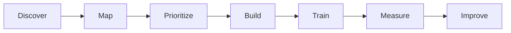
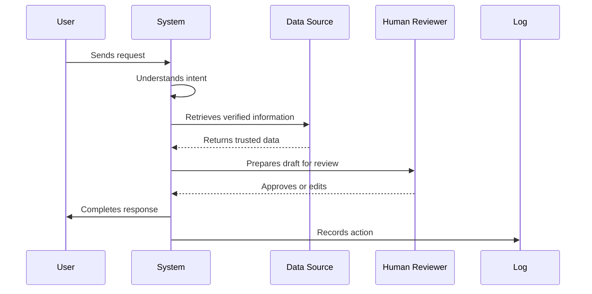

<p align="center">
  
</p>

<h1 align="center">Trellient</h1>

<p align="center">
  <strong>The structure growing businesses climb.</strong>
</p>

<p align="center">
  AI transformation systems for modern small and mid-sized businesses.
</p>

<p align="center">
  <a href="https://trellient.com"><strong>Website</strong></a>
  ·
  <a href="mailto:support@trellient.com"><strong>Contact</strong></a>
  ·
  <a href="https://github.com/enterprises/trellient"><strong>GitHub Enterprise</strong></a>
</p>

<br />

<p align="center">
  
  
  
</p>

<br />

---

## About Trellient

**Trellient** is an AI transformation partner for businesses that want to move from scattered AI experiments to practical, reliable, and measurable systems.

We help teams identify high-impact workflows, design automation-ready processes, implement AI-enabled systems, and support adoption with training, monitoring, and continuous improvement.

Our work focuses on real business outcomes: faster response times, reduced manual work, better operational visibility, stronger follow-up, and more resilient internal systems.

> Great businesses do not grow by effort alone.  
> They grow when the right structure supports them.  
> **Trellient builds that structure.**

---

## What We Do

We design and implement AI-enabled operational systems that help businesses work faster, smarter, and with greater consistency.

Our work may include:

- AI workflow automation
- Customer communication systems
- Sales and quotation workflows
- Document and data processing
- Internal AI assistants
- Human-in-the-loop approval systems
- Process audits and workflow mapping
- Automation monitoring and reporting
- Team training and operational enablement

We focus on practical systems that connect people, tools, data, and decisions.

---

## Our Approach

Trellient follows a structured transformation approach designed to reduce implementation risk and keep every project connected to measurable business value.



### Discover

We begin by understanding the business, its workflows, its tools, and the operational bottlenecks that matter most.

### Map

We map the current process, identify data sources, define decision points, and clarify where automation can safely create value.

### Prioritize

We select focused, high-impact use cases instead of attempting broad transformation all at once.

### Build

We implement reliable systems that combine automation, AI assistance, integrations, and human approval where needed.

### Train

We help teams understand how to use, review, and improve the systems being introduced.

### Measure

We track outcomes so the business can see what improved and where the next opportunity exists.

### Improve

We continuously refine systems based on usage, feedback, and operational results.

---

## Design Principles

### Outcome-First

Technology is only valuable when it improves a business outcome. We prioritize saved time, faster decisions, better follow-up, fewer errors, and clearer operations.

### Practical AI

AI should be applied where it is useful — not everywhere. We use automation for reliability, AI for ambiguity, and people for judgment.

### Human Control

Business-critical systems should be transparent and reviewable. We design approval flows, audit trails, and escalation paths into important workflows.

### Integration Over Isolation

AI creates the most value when it works inside the tools, data, and processes a business already uses.

### Simplicity Before Scale

We prefer clear, maintainable systems over complex architectures. Strong foundations make future scaling easier.

### Enablement, Not Dependency

We build systems that teams can understand, trust, and operate with confidence.

---

## Focus Areas

Trellient works across operationally intensive business functions where speed, accuracy, and consistency matter.

Common focus areas include:

- Customer enquiries and response workflows
- Sales operations and quotation processes
- Lead follow-up and pipeline communication
- Invoice and document handling
- Internal reporting and business digests
- Support triage and escalation
- Operations tracking and workflow visibility
- Data cleanup and process readiness

---

## Example System Pattern

A typical Trellient workflow follows a simple and reliable structure:



This pattern keeps AI useful, grounded, and accountable.

---

## Engineering Standards

Our engineering work is guided by reliability, clarity, and long-term maintainability.

We value:

- Clear documentation
- Secure defaults
- Least-privilege access
- Human approval for sensitive actions
- Structured logging
- Error monitoring
- Data minimization
- Reusable components
- Client-specific boundaries
- Simple systems before complex systems

---

## Security & Trust

Trust is central to every system Trellient builds.

We aim to design systems that are:

- Transparent
- Reviewable
- Measurable
- Secure by default
- Easy to operate
- Resilient under real-world usage

Automation should increase operational confidence, not create invisible risk.

---

## Repository Structure

This GitHub Enterprise space is used to organize Trellient’s technical foundation, internal tooling, reusable components, and documentation.

Example repository categories may include:

```txt
trellient/
├── automation-systems
├── integration-connectors
├── workflow-templates
├── internal-tools
├── deployment-infra
├── monitoring
├── documentation
└── research
```

Each repository should be documented, maintainable, and structured for responsible collaboration.

---

## Brand Promise

Trellient exists to help businesses adopt AI with structure, clarity, and confidence.

We are here to build systems that make operations more capable:

- Faster workflows
- Clearer decisions
- Better follow-up
- Less repetitive work
- Stronger visibility
- Measurable improvement
- Resilient growth

---

## Contact

For partnerships, pilots, support, or collaboration:

**Website:** [trellient.com](https://trellient.com)  
**Email:** [support@trellient.com](mailto:support@trellient.com)  
**GitHub Enterprise:** [github.com/enterprises/trellient](https://github.com/enterprises/trellient)

---

<p align="center">
  <strong>Trellient</strong>
  <br />
  <em>The structure growing businesses climb.</em>
</p>

<p align="center">
  Built for practical, measurable, and resilient AI transformation.
</p>
